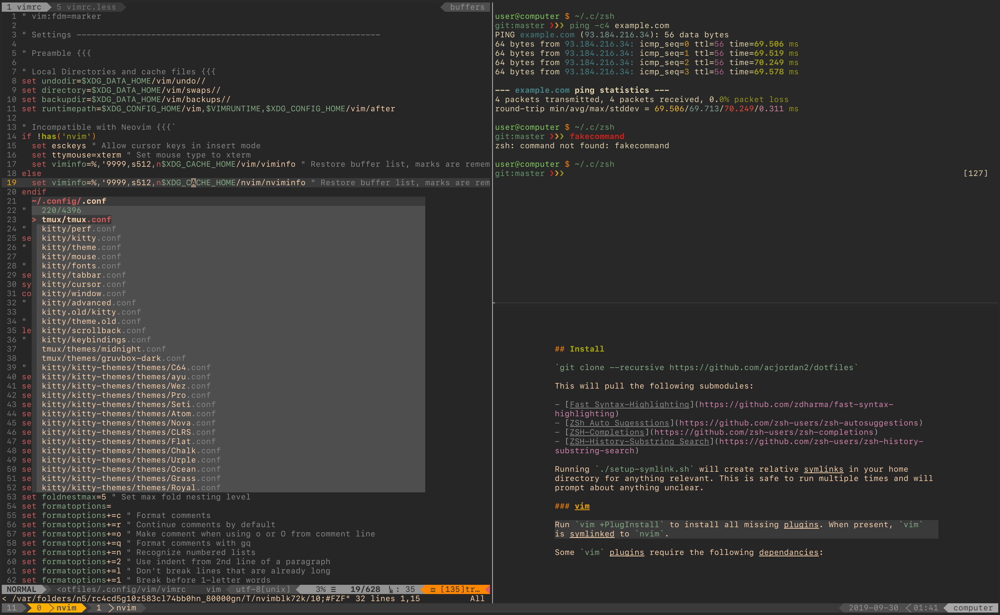

## Install

`git clone --recursive https://github.com/acjordan2/dotfiles`

This will pull the following submodules:

- [Fast Syntax-Highlighting](https://github.com/zdharma/fast-syntax-highlighting)
- [ZSh Auto Sugesstions](https://github.com/zsh-users/zsh-autosuggestions)
- [ZSH-Completions](https://github.com/zsh-users/zsh-completions)
- [ZSH-History-Substring Search](https://github.com/zsh-users/zsh-history-substring-search)

Running `./setup-symlink.sh` will create relative symlinks in your home directory for anything relevant. This is safe to run multiple times and will prompt about anything unclear. 

### vim 

Run `vim +PlugInstall` to install all missing plugins. When present, `vim` is symlinked to `nvim`.

Some `vim` plugins require the following dependencies:

- `FZF` for fuzzy file searching
- `nodejs`, used by `coc.vim` for code completion
- `ctags`, used by `gutentags` for function calls and var listings

### Firefox

The Firefox profile included disables telemetry and does some basic browser hardening. It is mostly copied from https://github.com/ghacksuserjs/ghacks-user.js/blob/master/user.js, with some usability tweaks. 

**Notes:**

- By default everything will run in `tmux` if available unless connected via an SSH session.  
- `tmux` is not aliased to use the config file in `$XDG_CONFIG_HOME`, whcih means running `tmux` directly will use `$HOME/.tmux.conf`
- All utils use the XDG base dir spec when possbile. 
- Using a recent version of ZSH (5.7+) is recommended

Screenshot:

